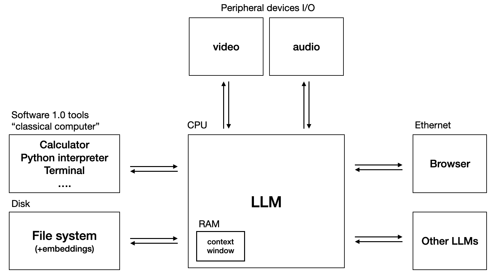

ava-os (personal project):

been developing a chat interface for a bigger project of developing an OS with an amazing role playing persona, if that's even possible with llms.

It is inspired by @karpathy's llm OS:

</img>

Current tech stack: 
Dolphin-mistral: Quality of uncensored role-playing is good when prompted correctly.
Ollama: For local inference of LLMs.
Todo:
1. Add system stats card in the dashboard 
2. Add realtime-listen
3. Add function calling to control stuff.
4. Widgets

Goal: Role-playing  OS wizard. NLP for controlling system settings and an assistant. Unaligned but ethical personality (dolphin-mistrals). Persona can respond by searching local files and as well as the web. Embedded IOT(must run on Raspberry Pis).